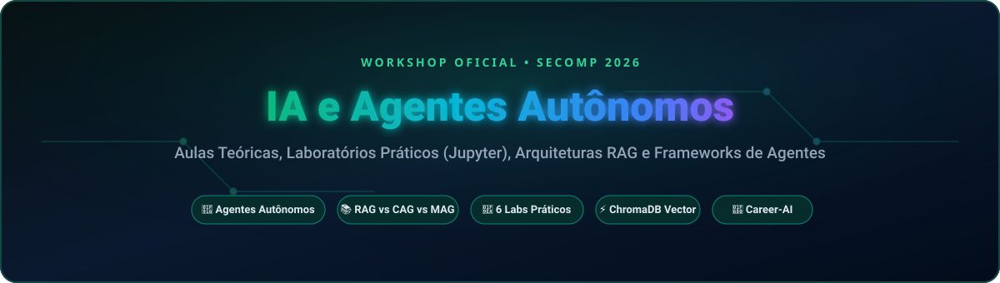

<div align="center">

  <!-- Banner Principal -->
  

  <br/><br/>

  <!-- Badges no Estilo for-the-badge -->
  <p align="center">
    <a href="https://github.com/EmmanuelNunes/SECOMP---IA">
      
    </a>
    <a href="https://www.python.org/">
      
    </a>
    <a href="https://jupyter.org/">
      
    </a>
    <a href="https://fastapi.tiangolo.com/">
      
    </a>
    <a href="https://www.trychroma.com/">
      
    </a>
  </p>

  <p align="center">
    <b>Repositório oficial de aulas, materiais teóricos e laboratórios práticos do Workshop de IA e Agentes Autônomos da SECOMP 2026.</b><br/>
    Do modelo conceitual à orquestração prática de agentes de IA, RAG multimodal e sistemas de software cognitivo.
  </p>

  <p align="center">
    <a href="#-laboratórios-práticos">Laboratórios</a> •
    <a href="#-estrutura-do-repositório">Estrutura</a> •
    <a href="#-projeto-integrador-career-ai">Projeto Career-AI</a> •
    <a href="#-referencial-metodológico">Pesquisa & Créditos</a> •
    <a href="#-equipe-e-instrutores">Equipe</a>
  </p>

</div>

---

## 🧪 Laboratórios Práticos (Hands-on)

O workshop combina teoria sólida e prática em notebooks interativos:

<div align="center">

| Lab | Tema Principal | Descrição / Entregável | Ambiente |
| :---: | :--- | :--- | :---: |
| **Lab 01** | Fundamentos de LLMs & Prompts | Chamadas estruturadas, formatação de saída e controle de alucinação | `Jupyter` |
| **Lab 02** | Embeddings & Busca Vetorial | Geração de representações vetoriais de texto e cálculo de similaridade por cosseno | `Jupyter` |
| **Lab 03** | RAG Básico (Retrieval-Augmented) | Ingestão de dados com ChromaDB, chunking e enriquecimento de contexto | `ChromaDB` |
| **Lab 04** | RAG Avançado vs. CAG vs. MAG | Estratégias comparativas de recuperação, re-ranking e janelas de contexto | `Jupyter` |
| **Lab 05** | Ferramentas & Function Calling | Conectando LLMs ao mundo real via APIs, busca externa e execução de código | `Python` |
| **Lab 06** | Agentes Autônomos & ReAct | Implementação de loops perceptivos de tomada de decisão com agentes de IA | `FastAPI` |

</div>

---

## 🚀 Projeto Integrador: Career-AI

Localizado no diretório [`src/`](src), o **Career-AI** é a aplicação integradora de demonstração do curso:
* **Arquitetura:** Backend assíncrono em **FastAPI** acoplado a uma base vetorial **ChromaDB**.
* **Objetivo:** Sistema inteligente de matching e aconselhamento de carreira que analisa perfis e currículos através de agentes especializados de triagem e orientação de competências.

---

## 📁 Estrutura do Repositório

```
SECOMP---IA/
├── apostila/                # Apostila teórica e conceitual completa do curso
├── cheatsheets/             # Guias de consulta rápida (MCP, RAG, CAG, MAG, Gemini Flash)
├── slides/                  # Apresentações oficiais do workshop (.pptx)
├── datasets/                # Conjuntos de dados (.jsonl) para os testes de RAG
├── laboratorios/            # Notebooks práticos (Lab 01 ao Lab 06)
├── src/                     # Código-fonte do projeto integrador Career-AI
└── assets/                  # Banners e recursos visuais oficiais
```

---

## 📌 Referencial Metodológico & Pesquisa

Este workshop e sua esteira didática apoiam-se em publicações científicas e pesquisas contemporâneas em agentes de IA:

### 👨‍🏫 Prof. M.Sc. Sanderson Oliveira de Macedo (Prof. Sandeco)
*Instituto Federal de Goiás (IFG) / Universidade Federal de Goiás (UFG)*

* 🎓 **Perfil Acadêmico:** [ResearchGate](https://www.researchgate.net/profile/Sanderson-Macedo) | 🐙 **GitHub Oficial:** [@sandeco](https://github.com/sandeco) | 🎥 **Canal:** [Canal Sandeco no YouTube](https://youtube.com/canalsandeco)
* 📄 **Publicações Referenciadas (2026):**
  * *O que faz de um arnês um arnês: condições necessárias e suficientes para um arnês de agente* ([arXiv:2606.10106](https://arxiv.org/abs/2606.10106))
  * *Do Prompt ao Processo: uma Taxonomia de Processos e Avaliação Comparativa de Frameworks de Suporte a Agentes de Desenvolvimento de Software de IA* ([arXiv:2606.04967](https://arxiv.org/abs/2606.04967))
  * *Reversa: Uma estrutura de engenharia de documentação reversa para converter software legado em especificações operacionais para agentes de IA* ([arXiv:2605.18684](https://arxiv.org/abs/2605.18684))

### 👨‍🏫 Prof. Dr. Carlos Alex Sander Juvêncio Gulo
*Universidade do Estado de Mato Grosso (UNEMAT) / Universidade do Porto (FEUP) / Grupo PIXEL*

* 🎓 **Perfil Acadêmico:** [Currículo Lattes (CNPq)](http://lattes.cnpq.br/0062065110639984) | [ResearchGate](https://www.researchgate.net/profile/Carlos-Gulo) | [Google Scholar](https://scholar.google.com/citations?user=carlos-gulo)
* 🔬 **Grupo de Pesquisa:** [Grupo PIXEL — Processamento de Imagem, Visão Computacional e Aplicações Interativas (UNEMAT)](http://dgp.cnpq.br/dgp/espelhogrupo/510344)
* 🏛️ **Atuação:** Professor Permanente do Curso de Ciência da Computação / FALECT (UNEMAT), Doutor em Engenharia Informática pela Faculdade de Engenharia da Universidade do Porto (FEUP / Portugal) e Mestre em Ciência da Computação (UNESP).

---

## 👨‍💻 Equipe e Instrutores

<div align="center">

| Instrutor / Pesquisador | Papel | Contato / Perfil |
| :--- | :--- | :---: |
| **Emmanuel Nunes** | Instrutor Principal & Desenvolvedor de Software | [](https://github.com/EmmanuelNunes) |
| **Prof. Dr. Carlos Alex Sander J. Gulo** | Orientador, Pesquisador e Professor Permanente (UNEMAT) | [](http://lattes.cnpq.br/0062065110639984) |

</div>

---

<div align="center">
  <sub>Construído com 💙 para a SECOMP 2026 • Compartilhe conhecimento e cite os autores!</sub>
</div>
