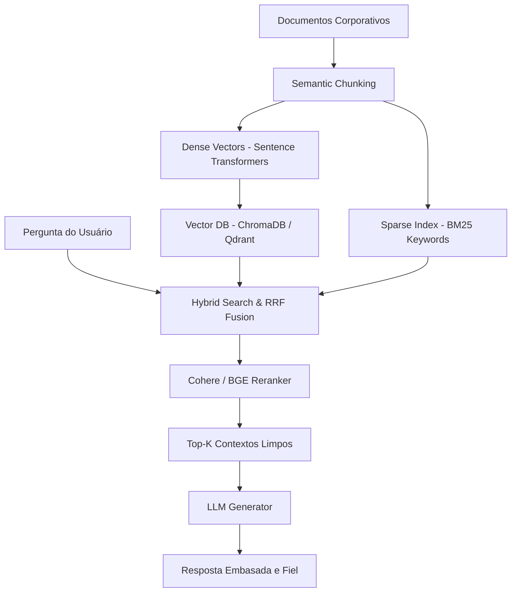

# 🚀 Apostila Oficial: Workshop de IA e Agentes Autônomos (SECOMP 2026)

Bem-vindo(a) à apostila oficial do **Workshop de IA e Agentes Autônomos** da **SECOMP 2026**! Este material foi completamente atualizado e expandido para refletir o estado da arte do ecossistema de Inteligência Artificial Generativa, Agentes Autônomos, o protocolo **MCP (Model Context Protocol)** e arquiteturas de recuperação **RAG Avançado (Hybrid & GraphRAG)**.

---

## 📌 Sumário
1. [Módulo 1: Introdução aos LLMs & Modelos de Raciocínio (2026)](#1-módulo-1-introdução-aos-llms--modelos-de-raciocínio-2026)
1.1 [Módulo 1.1: Guia de Prompting no Google Workspace com Gemini](#11-módulo-11-guia-de-prompting-no-google-workspace-com-gemini)
2. [Módulo 2: Engenharia de Prompts de Elite & Outputs Estruturados](#2-módulo-2-engenharia-de-prompts-de-elite--outputs-estruturados)
3. [Módulo 3: Model Context Protocol (MCP - Especificação Aberta)](#3-módulo-3-model-context-protocol-mcp---especificação-aberta)
4. [Módulo 4: Agentes Autônomos & Orquestração Multi-Agente](#4-módulo-4-agentes-autônomos--orquestração-multi-agente)
5. [Módulo 5: RAG Avançado, Busca Híbrida & GraphRAG](#5-módulo-5-rag-avançado-busca-híbrida--graphrag)
6. [Módulo 6: Segurança, Governança & OWASP Top 10 para LLMs](#6-módulo-6-segurança-governança--owasp-top-10-para-llms)
7. [Módulo 7: Projeto Prático Integrador — Career-AI (MVP 2026)](#7-módulo-7-projeto-prático-integrador---career-ai-mvp-2026)

---

## 1. Módulo 1: Introdução aos LLMs & Modelos de Raciocínio (2026)

Os **Grandes Modelos de Linguagem (LLMs)** evoluíram da previsão ingênua de tokens para sistemas altamente sofisticados capazes de raciocínio lógico em tempo de inferência (*Test-Time Compute*), arquiteturas de mistura de especialistas (*Mixture of Experts - MoE*) e execução nativa multimodal.

### A Evolução Arquitetural (De 2017 a 2026)
* **Transformers Clássicos (2017-2023):** Processamento baseado unicamente em self-attention.
* **Mixture of Experts - MoE (2024-2025):** Ativação seletiva de sub-redes (especialistas) reduzindo custo computacional enquanto amplia parâmetros totais.
* **Modelos de Raciocínio (Reasoning Models / 2025-2026):** Modelos como Gemini 2.0 Flash Thinking, DeepSeek-R1 e OpenAI o1/o3 que utilizam cadeias de pensamento internas (*Chain-of-Thought*) expandidas antes de emitir a resposta final, resolvendo problemas complexos de código, matemática e lógica formal.

### Principais Capacidades Modernas em 2026
1. **Janelas de Contexto Gigantescas:** Suporte a 1M até 10M+ tokens de contexto (ex: ecossistema Gemini), permitindo carregar repositórios inteiros de código ou livros em uma única chamada.
2. **Multimodalidade Nativa:** Processamento e geração síncrona de texto, imagens, áudio, vídeo e eventos de tela (real-time voice & vision).
3. **Structured Outputs (Saídas Garantidas):** Garantia matemática de conformidade com schemas JSON/Pydantic na camada de amostragem de tokens.

---

## 1.1. Módulo 1.1: Guia de Prompting no Google Workspace com Gemini

A integração da Inteligência Artificial Generativa corporativa no Google Workspace une modelos de última geração aos dados institucionais em um ambiente seguro e em conformidade com a privacidade.

### Ecossistema Gemini no Workspace (Edição 2026)

1. **Aplicativos AI-First:**
   * **Gemini App (Corporate):** Chat com suporte a *Deep Research* (agente autônomo de pesquisa profunda que analisa centenas de fontes web e documentos) e *Canvas* (ambiente de edição iterativa).
   * **NotebookLM:** Assistente de pesquisa baseado nos seus documentos do Google Drive, PDFs e notas, oferecendo resumos, mapas mentais e o *Audio Overview* (podcasts gerados via IA baseados nos seus textos).
   * **Google Vids:** Ferramenta de criação de apresentações e vídeos interativos baseados em IA.
2. **Painel Lateral Embutido:** Acesso in-line no Gmail, Docs, Slides, Sheets e Drive com grounding dinâmico via marcação `@` (ex: `@Proposta2026.pdf`).

> [!IMPORTANT]
> **Governança e Privacidade:** Os dados corporativos processados pelo Gemini no Workspace **não são utilizados para treinamento de modelos públicos**, não passam por revisão humana e permanecem protegidos por criptografia de nível enterprise.

### Os 5 Pilares de um Prompt Profissional (Prompting 101)

| Pilar | Descrição | Exemplo Prático |
| :--- | :--- | :--- |
| **Persona (Papel)** | Identidade técnica ou executiva assumida pelo LLM. | *"Você é um Diretor de Tecnologia especializado em microsserviços."* |
| **Task (Tarefa)** | Ação principal detalhada iniciada por verbo no imperativo. | *"Escreva um documento de arquitetura referente à migração do sistema."* |
| **Context (Contexto)** | Informações de fundo, restrições e cenário de negócio. | *"Considerando que a equipe possui 5 desenvolvedores e utiliza AWS."* |
| **Constraints (Restrições)** | Limites que o modelo NÃO pode ultrapassar. | *"Não utilize bibliotecas obsoletas. Não invente credenciais."* |
| **Format (Formato)** | Estrutura visual exata da saída esperada. | *"Responda em formato Markdown com diagramas Mermaid e tabelas."* |

---

## 2. Módulo 2: Engenharia de Prompts de Elite & Outputs Estruturados

A **Engenharia de Prompts** deixou de ser a simples escrita de textos para se tornar o projeto rigoroso de interfaces de entrada/saída para componentes de software de IA.

### Técnicas Avançadas de Prompting (2026)

1. **Few-Shot Prompting com Exemplos Estruturados:** Fornecer 2 a 3 pares de exemplo (input -> output) para calibrar exatamente o padrão de resposta do modelo.
2. **Chain-of-Thought (CoT) Delimitado:** Forçar o modelo a explicitar o passo a passo de raciocínio dentro de tags XML `<thinking>...</thinking>` antes da resposta final `<answer>...</answer>`.
3. **System Prompts com Delimitadores XML:**
   ```xml
   <system_instructions>
     Você é o assistente oficial da SECOMP 2026.
     Use estritamente o contexto fornecido em <context>.
   </system_instructions>
   
   <context>
     {documentos_recuperados_do_rag}
   </context>
   
   <user_query>
     {pergunta_do_usuario}
   </user_query>
   ```
4. **Structured Outputs (Saída JSON Garantida):** Uso de bibliotecas como `Pydantic` em Python para garantir que a resposta do LLM seja desserializada diretamente em objetos da aplicação sem falhas de sintaxe JSON.

---

## 3. Módulo 3: Model Context Protocol (MCP - Especificação Aberta)

O **Model Context Protocol (MCP)** é o padrão aberto mantido sob governança da Linux Foundation (criado originalmente pela Anthropic) que revoluciona como os LLMs se conectam ao mundo externo.

### Por que o MCP Substituiu APIs Ad-Hoc?
Antes do MCP, cada ferramenta exigia código de integração proprietário. O MCP introduz uma camada universal `Client-Server` via protocolo **JSON-RPC 2.0** que padroniza o acesso a qualquer recurso.

```mermaid
graph LR
    Agent[Agente / IDE Cliente] <--> |MCP Protocol (Stdio / SSE)| MCPServer[MCP Server]
    MCPServer <--> Tools[Tools: APIs / GitHub / Terminal]
    MCPServer <--> Resources[Resources: DBs / Filesystem]
    MCPServer <--> Prompts[Prompts: Templates do Servidor]
```

### As 3 Abstrações Principais do MCP
1. **Tools (Ferramentas):** Funções executáveis com parâmetros validados por JSON Schema que o LLM pode invocar autonomamente.
2. **Resources (Recursos):** Fontes de dados expostas via URIs (`file://`, `postgres://`, `github://`) para leitura passiva pelo modelo.
3. **Prompts:** Modelos e fluxos reutilizáveis definidos pelo servidor.

---

## 4. Módulo 4: Agentes Autônomos & Orquestração Multi-Agente

Um **Agente de IA** é um sistema computacional que utiliza um LLM como motor de raciocínio central para perceber um objetivo, planejar ações, executar ferramentas em loop e ajustar sua conduta com base nas observações do ambiente.

### Ciclo ReAct (Reasoning + Acting)
```
[Objetivo do Usuário] 
    ↓
[Pensamento (Reasoning)] → "Preciso ler o arquivo X para entender o erro."
    ↓
[Ação (Acting)] → Executa a Tool `read_file("X.py")`
    ↓
[Observação (Observation)] → Retorna o conteúdo e o erro da linha 42
    ↓
[Pensamento (Reasoning)] → "O erro é uma divisão por zero. Vou aplicar a correção."
    ↓
[Ação (Acting)] → Executa a Tool `replace_file_content(...)`
    ↓
[Conclusão] → Informa o usuário que o bug foi corrigido.
```

### Arquiteturas Multi-Agente (LangGraph / CrewAI)
* **Supervisor Pattern:** Um agente gerenciador recebe a requisição master e distribui sub-tarefas para agentes especialistas (ex: Agente de Pesquisa, Agente de Código, Agente de Testes).
* **Human-in-the-Loop (HITL):** Interrupção controlada no fluxo para solicitar confirmação humana antes de ações de risco (ex: deleção de banco ou deploy em produção).

---

## 5. Módulo 5: RAG Avançado, Busca Híbrida & GraphRAG

O **RAG (Retrieval-Augmented Generation)** é a técnica essencial para fundamentar LLMs em dados corporativos atualizados, eliminando alucinações.


```mermaid
flowchart TD
    Doc[Documentos Corporativos] --> SemanticChunking[Semantic Chunking]
    SemanticChunking --> DenseEmbed[Dense Vectors - Sentence Transformers]
    SemanticChunking --> SparseIndex[Sparse Index - BM25 Keywords]
    DenseEmbed --> VectorDB[Vector DB - ChromaDB / Qdrant]
    
    Query[Pergunta do Usuário] --> HybridSearch[Hybrid Search & RRF Fusion]
    VectorDB --> HybridSearch
    SparseIndex --> HybridSearch
    
    HybridSearch --> Reranker[Cohere / BGE Reranker]
    Reranker --> TopKContext[Top-K Contextos Limpos]
    TopKContext --> LLM[LLM Generator]
    LLM --> FinalAnswer[Resposta Embasada e Fiel]
```

### Técnicas de RAG de Última Geração
1. **Hybrid Search (Busca Híbrida):** Combinação da busca vetorial (densamente semântica) com busca por palavras-chave exatas (sparse BM25) unificadas pelo algoritmo **RRF (Reciprocal Rank Fusion)**.
2. **Reranking:** Reordenação precisa dos documentos recuperados utilizando modelos de *Cross-Encoder* para filtrar ruídos antes de enviar ao prompt.
3. **GraphRAG:** Integração de Grafos de Conhecimento (extração de entidades e relacionamentos) com busca vetorial, permitindo responder a perguntas globais e sintetizar grandes volumes de documentos interconectados.

---

## 6. Módulo 6: Segurança, Governança & OWASP Top 10 para LLMs

A segurança em sistemas com LLMs requer proteções contra ameaças atípicas ao software tradicional.

### O Top 4 de Vulnerabilidades em Sistemas com LLM (OWASP)

1. **Prompt Injection (Direta e Indireta):**
   * *Direta:* O usuário envia texto tentando sobrescrever as regras do sistema.
   * *Indireta:* O LLM lê um documento RAG ou site web contaminado com instruções maliciosas ocultas.
   * *Mitigação:* Isolar delimitadores XML, higienizar saídas e utilizar classificadores de entrada.
2. **Data Leakage (Vazamento de Dados / PII):**
   * Exposição acidental de informações confidenciais contidas no Vector DB.
   * *Mitigação:* Controle de acesso baseado em função (RBAC) no banco vetorial e anonimização prévia de PII.
3. **Excessive Agency (Agência Excessiva):**
   * Concessão de permissões destrutivas para agentes sem trava.
   * *Mitigação:* Aplicação do Princípio do Menor Privilégio e Human-in-the-Loop (HITL).
4. **Guardrails Ativos:**
   * Utilização de bibliotecas especializadas (como *NeMo Guardrails* ou *Llama Guard*) para filtrar e bloquear prompts/respostas nocivas em milissegundos.

---

## 7. Módulo 7: Projeto Prático Integrador — Career-AI (MVP 2026)

O **Career-AI** é a aplicação prática desenvolvida no workshop que consolida todos os conceitos em uma solução end-to-end completa.

### Arquitetura de Código (`src/`)

```
src/
├── requirements.txt         # Dependências do projeto (FastAPI, ChromaDB, LangGraph...)
├── agents/                  # Agentes Autônomos Orquestrados
│   ├── resume_agent.py      # Agente de Análise e Otimização de Currículos
│   ├── interview_agent.py   # Agente Simulador de Entrevistas Técnicas
│   └── learning_agent.py    # Agente Gerador de Trilhas de Estudo Personalizadas
├── backend/                 # API FastAPI de Comunicação
│   ├── app.py               # Servidor e Inicialização
│   ├── routes.py            # Rotas de Endpoints REST
│   └── services.py          # Regras de Negócio e Conexões
├── frontend/                # Interface do Usuário (HTML5 / Vanilla CSS / JS)
│   └── index.html           # Dashboard Interativo do Career-AI
└── rag/                     # Engine de RAG Avançado
    ├── document_processor.py# Ingestão e Semantic Chunking de Datasets
    ├── vector_store.py      # Gerenciador de Persistência Vetorial (ChromaDB)
    └── retriever.py         # Retriever Híbrido com Reranking
```

---
*Apostila atualizada para a SECOMP 2026 — Mantida por Emmanuel Nunes com apoio de IA.* 💙
