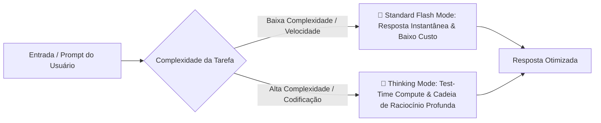
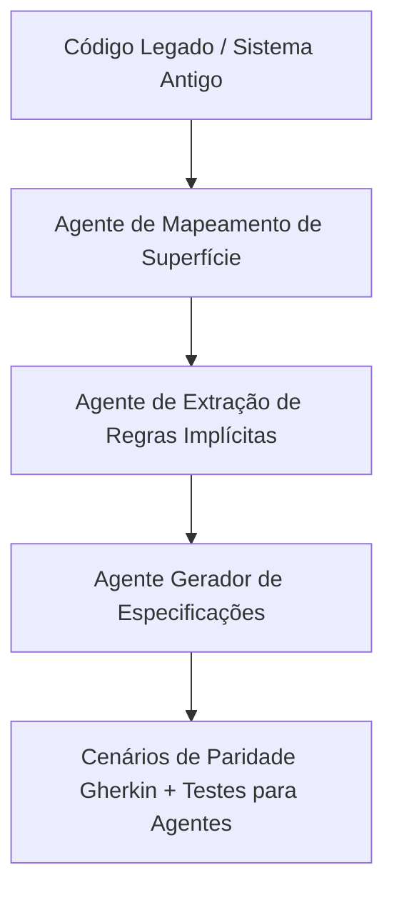
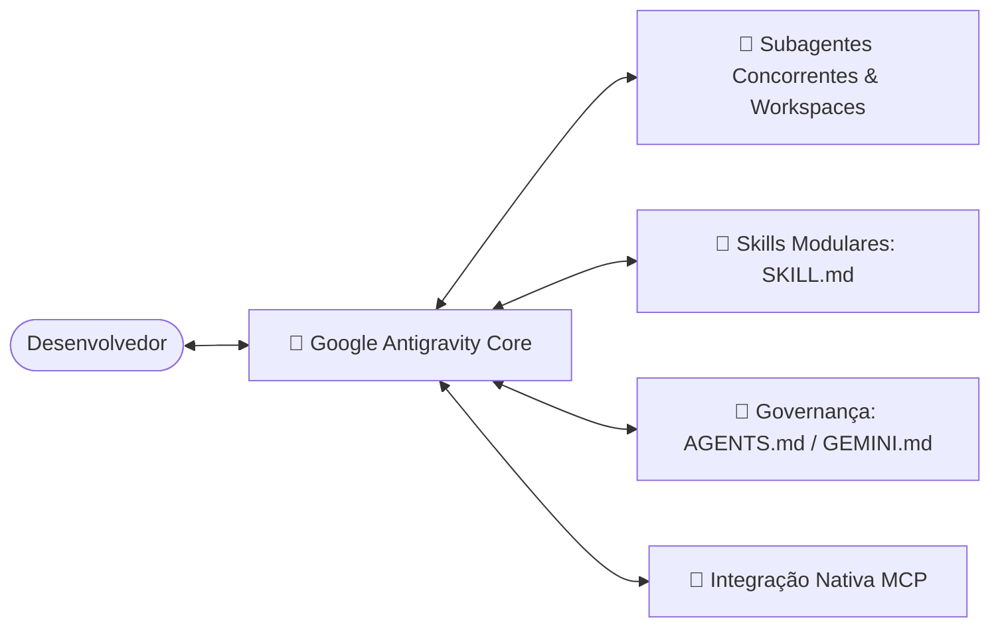
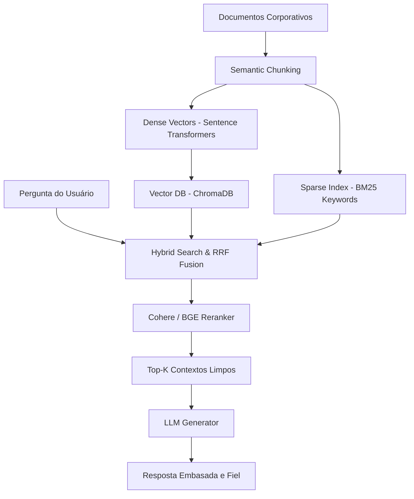
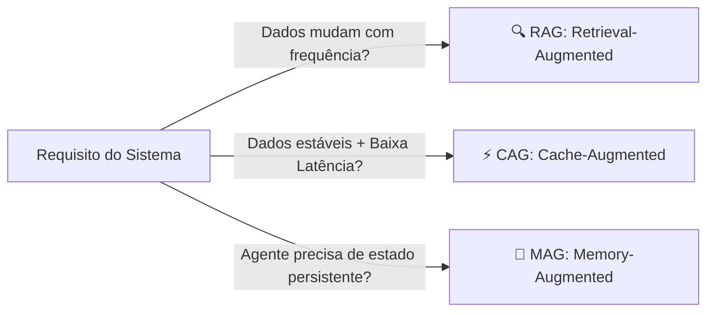

# 🚀 Apostila Oficial: Workshop de IA e Agentes Autônomos (SECOMP 2026)

Bem-vindo(a) à apostila oficial do **Workshop de IA e Agentes Autônomos** da **SECOMP 2026**! Este material foi elaborado e atualizado com base nos conceitos mais recentes de Inteligência Artificial Generativa, Agentes Autônomos, o protocolo **MCP (Model Context Protocol)** e arquiteturas de recuperação **RAG Avançado (Hybrid & GraphRAG)**.

> [!NOTE]
> **Créditos e Agradecimento Especial:**
> Este material e a metodologia adotada possuem fundamentação acadêmica e conceitual nos trabalhos, pesquisas e ferramentas desenvolvidas pelo **Prof. M.Sc. Sanderson Oliveira de Macedo (Prof. Sandeco)** — Instituto Federal de Goiás (IFG) / Universidade Federal de Goiás (UFG), criador do [Canal Sandeco](https://youtube.com/canalsandeco), do framework [Reversa](https://github.com/sandeco/reversa) e do ecossistema [Mira Animator](https://github.com/sandeco/mira-animator).

---

## 📌 Sumário
1. [Módulo 1: Introdução aos LLMs & Modelos de Raciocínio (2026)](#1-módulo-1-introdução-aos-llms--modelos-de-raciocínio-2026)
1.1 [Módulo 1.1: Guia de Prompting no Google Workspace com Gemini](#11-módulo-11-guia-de-prompting-no-google-workspace-com-gemini)
1.2 [Módulo 1.2: O Modelo Vigente: Gemini 3.7 Flash & Raciocínio Híbrido](#12-módulo-12-o-modelo-vigente-gemini-37-flash--raciocínio-híbrido)
2. [Módulo 2: Engenharia de Prompts de Elite & Outputs Estruturados](#2-módulo-2-engenharia-de-prompts-de-elite--outputs-estruturados)
3. [Módulo 3: Model Context Protocol (MCP - Especificação Aberta)](#3-módulo-3-model-context-protocol-mcp---especificação-aberta)
4. [Módulo 4: Agentes Autônomos, Agent Harnesses, Framework Reversa & Antigravity](#4-módulo-4-agentes-autônomos-agent-harnesses-framework-reversa--antigravity)
5. [Módulo 5: RAG Avançado, Paradigmas de Contexto (RAG vs. CAG vs. MAG) & GraphRAG](#5-módulo-5-rag-avançado-paradigmas-de-contexto-rag-vs-cag-vs-mag--graphrag)
6. [Módulo 6: Segurança, Governança & OWASP Top 10 para LLMs](#6-módulo-6-segurança-governança--owasp-top-10-para-llms)
7. [Módulo 7: Projeto Prático Integrador — Career-AI (MVP 2026)](#7-módulo-7-projeto-prático-integrador---career-ai-mvp-2026)
8. [Módulo 8: Referências Acadêmicas & Trabalhos do Prof. Sanderson Macedo](#8-módulo-8-referências-acadêmicas--trabalhos-do-prof-sanderson-macedo)

---

## 1. Módulo 1: Introdução aos LLMs & Modelos de Raciocínio (2026)

Os **Grandes Modelos de Linguagem (LLMs)** evoluíram para sistemas altamente sofisticados capazes de raciocínio lógico em tempo de inferência (*Test-Time Compute*), arquiteturas de mistura de especialistas (*Mixture of Experts - MoE*) e execução nativa multimodal.

### A Evolução Arquitetural
* **Transformers Clássicos (2017-2023):** Processamento baseado unicamente em self-attention de passo único.
* **Mixture of Experts - MoE (2024-2025):** Ativação seletiva de sub-redes (especialistas) reduzindo custo computacional enquanto amplia parâmetros totais.
* **Modelos de Raciocínio (Reasoning Models / 2025-2026):** Modelos que utilizam cadeias de pensamento internas (*Chain-of-Thought*) expandidas antes de emitir a resposta final, resolvendo problemas complexos de código, matemática e lógica formal.

### Principais Capacidades Modernas
1. **Janelas de Contexto Gigantescas:** Suporte a 1M até 10M+ tokens de contexto (ex: ecossistema Gemini), permitindo carregar repositórios inteiros de código em uma única chamada.
2. **Multimodalidade Nativa:** Processamento e geração síncrona de texto, imagens, áudio e vídeo (real-time voice & vision).
3. **Structured Outputs (Saídas Garantidas):** Garantia matemática de conformidade com schemas JSON/Pydantic na camada de amostragem de tokens.

---

## 1.1. Módulo 1.1: Guia de Prompting no Google Workspace com Gemini

A integração da IA Generativa no Google Workspace une modelos de última geração aos dados institucionais em um ambiente seguro e em conformidade com a privacidade.

### Ecossistema Gemini no Workspace
1. **Aplicativos AI-First:**
   * **Gemini App (Corporate):** Chat com suporte a *Deep Research* (agente autônomo de pesquisa profunda) e *Canvas* (ambiente de edição iterativa).
   * **NotebookLM:** Assistente de pesquisa baseado nos seus documentos do Google Drive, PDFs e notas, oferecendo resumos e o *Audio Overview* (podcasts gerados via IA baseados nos seus textos).
   * **Google Vids:** Ferramenta de criação de apresentações e vídeos interativos baseados em IA.
2. **Painel Lateral Embutido:** Acesso in-line no Gmail, Docs, Slides, Sheets e Drive com grounding dinâmico via marcação `@`.

> [!IMPORTANT]
> **Governança e Privacidade:** Os dados corporativos processados pelo Gemini no Workspace **não são utilizados para treinamento de modelos públicos**, não passam por revisão humana e permanecem protegidos por criptografia de nível enterprise.

---

## 1.2. Módulo 1.2: O Modelo Vigente: Gemini 3.7 Flash & Raciocínio Híbrido

O **Gemini 3.7 Flash** representa o estado da arte dos modelos de linguagem da Google em 2026, sendo o primeiro modelo de **Raciocínio Híbrido (*Hybrid Reasoning Engine*)** de classe mundial.

```mermaid
graph LR
    Input[Entrada / Prompt do Usuário] --> Router{Complexidade da Tarefa}
    Router -->|Baixa Complexidade / Velocidade| FlashMode[🚀 Standard Flash Mode: Resposta Instantânea & Baixo Custo]
    Router -->|Alta Complexidade / Codificação| ThinkingMode[🧠 Thinking Mode: Test-Time Compute & Cadeia de Raciocínio Profunda]
    FlashMode --> Output[Resposta Otimizada]
    ThinkingMode --> Output
```

### Principais Inovações do Gemini 3.7 Flash
1. **Unificação de Velocidade e Profundidade:** Elimina a necessidade de escolher entre um modelo ultra-rápido (como os modelos Flash anteriores) e um modelo lento de raciocínio puro. Ele opera nativamente em ambos os regimes através do controle de *Thinking Budget* (orçamento de pensamento ajustável).
2. **Liderança em Engenharia de Software e Agentes:** Desempenho de ponta na resolução autônoma de issues complexas em repositórios reais (benchmarks SWE-bench), refatorações arquiteturais e geração de código livre de bugs.
3. **Context Caching Nativo de Alta Eficiência:** Permite que 1 Milhão de tokens de documentação e código sejam mantidos em memória de inferência com custo até 90% menor e Time-To-First-Token (TTFT) instantâneo.
4. **Chamada de Ferramentas de Primeira Classe:** Integração nativa com o protocolo MCP e ferramentas de sistema com rigorosa validação de tipos e structured outputs.

## 2. Módulo 2: Engenharia de Prompts de Elite & Outputs Estruturados

A **Engenharia de Prompts** é o projeto rigoroso de interfaces de entrada/saída para componentes de software de IA.

### Os 5 Pilares de um Prompt Profissional (Prompting 101)

| Pilar | Descrição | Exemplo Prático |
| :--- | :--- | :--- |
| **Persona (Papel)** | Identidade técnica ou executiva assumida pelo LLM. | *"Você é um Diretor de Tecnologia especializado em microsserviços."* |
| **Task (Tarefa)** | Ação principal detalhada iniciada por verbo no imperativo. | *"Escreva um documento de arquitetura referente à migração do sistema."* |
| **Context (Contexto)** | Informações de fundo, restrições e cenário de negócio. | *"Considerando que a equipe possui 5 desenvolvedores e utiliza AWS."* |
| **Constraints (Restrições)** | Limites que o modelo NÃO pode ultrapassar. | *"Não utilize bibliotecas obsoletas. Não invente credenciais."* |
| **Format (Formato)** | Estrutura visual exata da saída esperada. | *"Responda em formato Markdown com diagramas Mermaid e tabelas."* |

---

## 3. Módulo 3: Model Context Protocol (MCP - Especificação Aberta)

O **Model Context Protocol (MCP)** é o padrão aberto mantido sob governança da Linux Foundation (criado originalmente pela Anthropic) que revoluciona como os LLMs se conectam ao mundo externo.

### Arquitetura de Comunicação do MCP
```mermaid
graph LR
    Agent[Agente / IDE Cliente] <--> |MCP Protocol (Stdio / SSE)| MCPServer[MCP Server]
    MCPServer <--> Tools[Tools: APIs / GitHub / Terminal]
    MCPServer <--> Resources[Resources: DBs / Filesystem]
    MCPServer <--> Prompts[Prompts: Templates do Servidor]
```

### As 3 Abstrações Principais
1. **Tools (Ferramentas):** Funções executáveis com parâmetros validados por JSON Schema que o LLM pode invocar autonomamente.
2. **Resources (Recursos):** Fontes de dados expostas via URIs (`file://`, `postgres://`, `github://`) para leitura passiva pelo modelo.
3. **Prompts:** Modelos e fluxos reutilizáveis definidos pelo servidor.

---

## 4. Módulo 4: Agentes Autônomos, Agent Harnesses, Framework Reversa & Antigravity

Um **Agente de IA** é um sistema computacional que utiliza um LLM como motor de raciocínio central para perceber um objetivo, planejar ações, executar ferramentas em loop e ajustar sua conduta.

### 4.1. O Conceito de Agent Harness (Macedo, 2026)
Conforme definido pelo Prof. Sanderson Macedo no artigo *"What makes a harness a harness"* (arXiv:2606.10106), o **Agent Harness** é a camada de software que envolve um modelo de linguagem e o capacita a atuar diretamente sobre repositórios de código com isolamento, ciclo de vida e controle de execução.

### 4.2. O Framework Reversa (Macedo & Costa, 2026)
Desenvolvido pelo Prof. Sanderson Macedo, o **Reversa** ([github.com/sandeco/reversa](https://github.com/sandeco/reversa), arXiv:2605.18684) é um framework de engenharia reversa de documentação que converte sistemas legados em especificações operacionais rastreáveis e executáveis por agentes de IA através de uma pipeline multi-agente:

```mermaid
graph TD
    Legacy[Código Legado / Sistema Antigo] --> Surface[Agente de Mapeamento de Superfície]
    Surface --> Rules[Agente de Extração de Regras Implícitas]
    Rules --> Spec[Agente Gerador de Especificações]
    Spec --> Gherkin[Cenários de Paridade Gherkin + Testes para Agentes]
```

### 4.3. Ambientes de Desenvolvimento Agêntico: Google Antigravity (AGY)
O **Google Antigravity (AGY)** é a plataforma avançada concebida pela equipe do Google DeepMind que operacionaliza o desenvolvimento agêntico na prática, integrando ferramentas de terminal, subagentes especializados e modelos de raciocínio como o **Gemini 3.7 Flash**.

```mermaid
flowchart LR
    Dev([Desenvolvedor]) <--> Antigravity[🤖 Google Antigravity Core]
    Antigravity <--> Subagents[👥 Subagentes Concorrentes & Workspaces]
    Antigravity <--> Skills[🧩 Skills Modulares: SKILL.md]
    Antigravity <--> Rules[📜 Governança: AGENTS.md / GEMINI.md]
    Antigravity <--> MCP[🔌 Integração Nativa MCP]
```

#### Pilares do Antigravity na SECOMP 2026:
1. **Subagentes Hierárquicos e Concorrentes:** Capacidade de lançar subagentes em segundo plano (`research`, `self`, ou customizados em tempo de execução via `define_subagent`) com isolamento de repositório (*workspaces* `branch` / `share` / `inherit`).
2. **Sistema de Skills Encapsuladas:** Habilidades modulares compostas por `SKILL.md` (metadados YAML), scripts em Python/Shell e materiais de referência carregados dinamicamente sob demanda.
3. **Governança por Regras Vivas (`AGENTS.md`):** Arquivos declarativos na raiz do projeto que ditam a conduta, restrições e padrões arquiteturais que nenhum subagente pode violar.
4. **Rastreabilidade e Artefatos:** Geração de documentos vivos (`artifacts`), diffs contínuos e auditoria passo a passo via arquivos de transcrição (`transcript.jsonl`).

---

## 5. Módulo 5: RAG Avançado, Paradigmas de Contexto (RAG vs. CAG vs. MAG) & GraphRAG

O **RAG (Retrieval-Augmented Generation)** é a técnica essencial para fundamentar LLMs em dados corporativos atualizados, eliminando alucinações. Contudo, no estado da arte de 2026, a gestão de contexto evoluiu para três paradigmas complementares: **RAG**, **CAG** e **MAG**.

### 5.1. O Pipeline Clássico e Avançado de RAG

```mermaid
flowchart TD
    Doc[Documentos Corporativos] --> SemanticChunking[Semantic Chunking]
    SemanticChunking --> DenseEmbed[Dense Vectors - Sentence Transformers]
    SemanticChunking --> SparseIndex[Sparse Index - BM25 Keywords]
    DenseEmbed --> VectorDB[Vector DB - ChromaDB]
    
    Query[Pergunta do Usuário] --> HybridSearch[Hybrid Search & RRF Fusion]
    VectorDB --> HybridSearch
    SparseIndex --> HybridSearch
    
    HybridSearch --> Reranker[Cohere / BGE Reranker]
    Reranker --> TopKContext[Top-K Contextos Limpos]
    TopKContext --> LLM[LLM Generator]
    LLM --> FinalAnswer[Resposta Embasada e Fiel]
```

#### Tecnologias do RAG Avançado
1. **Hybrid Search (Busca Híbrida):** Combinação de busca vetorial densa com busca esparsa BM25 unificadas por *Reciprocal Rank Fusion (RRF)*.
2. **Reranking:** Reordenação precisa dos fragmentos de texto via modelos *Cross-Encoder*.
3. **GraphRAG:** Integração de Grafos de Conhecimento com busca vetorial para sintetizar dados complexos interconectados.

---

### 5.2. O Grande Dilema Arquitetural: RAG vs. CAG vs. MAG

A decisão arquitetural mais importante em sistemas agentic modernos não é eleger o "melhor" método, mas sim **escolher a arquitetura correta para a dinâmica da sua carga de trabalho**:

```mermaid
graph LR
    Need[Requisito do Sistema] -->|Dados mudam com frequência?| RAG[🔍 RAG: Retrieval-Augmented]
    Need -->|Dados estáveis + Baixa Latência?| CAG[⚡ CAG: Cache-Augmented]
    Need -->|Agente precisa de estado persistente?| MAG[🧠 MAG: Memory-Augmented]
```

#### 1. 🔍 RAG (Retrieval-Augmented Generation) — Dados Dinâmicos & Grandes Escalas
* **Mecanismo:** Recupera sob demanda fragmentos relevantes indexados em bancos vetoriais (ChromaDB, Pinecone, Qdrant) e os injeta no prompt do LLM.
* **Quando Usar:** Bases de dados que são atualizadas a cada minuto ou dia (vagas de emprego, notícias, relatórios diários, políticas em constante mudança).
* **Vantagens:** Escalabilidade ilimitada em volume de dados; dados sempre frescos sem reprocessar modelos.
* **Trade-offs:** Latência moderada/alta (overhead de busca + reranking); risco de perda de contexto entre chunks (*chunk boundary loss*).

#### 2. ⚡ CAG (Cache-Augmented Generation) — Dados Estáticos & Latência Zero
* **Mecanismo:** Utiliza as imensas janelas de contexto modernas (1M a 10M+ tokens) e tecnologias de *Context Caching / KV Caching / Prefix Caching* (Gemini, Claude, vLLM, SGLang) para carregar documentos inteiros diretamente na memória GPU do modelo.
* **Quando Usar:** Bases de conhecimento estáveis onde a velocidade de resposta (Time To First Token - TTFT) e o raciocínio holístico sobre o documento inteiro são vitais (manuais técnicos, documentação de APIs, diretrizes do workshop, bases de código congeladas).
* **Vantagens:** Latência ultrabaixa (ignora toda a etapa de busca vetorial); 100% de precisão contextual (sem cortes de chunking); desconto de até 75%-90% no custo de tokens em cache.
* **Trade-offs:** Inviável para dados que mudam a todo instante (qualquer modificação exige invalidar e reconstruir o cache).

#### 3. 🧠 MAG (Memory-Augmented Generation) — Memória Evolutiva & Continuidade de Agentes
* **Mecanismo:** Estrutura camadas de memória contínua (**Episódica**, **Semântica** e **Procedural**) para agentes autônomos utilizando frameworks como Mem0, Letta (MemGPT), Zep ou LangGraph Store.
* **Quando Usar:** Agentes autônomos, assistentes de carreira personalizados (como o *Career-AI*), copilotos de desenvolvimento e sistemas com interações contínuas em múltiplas sessões.
* **Vantagens:** O agente "lembra" do usuário ao longo do tempo, personaliza recomendações, armazena feedbacks passados e não repete erros cometidos em conversas anteriores.
* **Trade-offs:** Exige mecanismos de consolidação assíncrona, sumarização periódica e resolução de contradições de memórias.

---

### 5.3. Tabela Comparativa de Paradigmas

| Dimensão | 🔍 RAG (Retrieval) | ⚡ CAG (Cache) | 🧠 MAG (Memory) |
| :--- | :--- | :--- | :--- |
| **Foco Primário** | Informação externa e atualizada | Velocidade extrema e contexto total | Continuidade e estado do usuário/agente |
| **Fonte do Contexto** | Banco vetorial / Índices BM25 | Memória KV Cache / Janela Longa | Memórias persistentes (Episódica/Semântica) |
| **Dinamismo dos Dados** | Alto (alterações constantes) | Baixo (estático ou pré-compilado) | Dinâmico-Cumulativo (evolui com o uso) |
| **Latência (TTFT)** | Média a Alta (busca + rerank) | Ultrabaixa (quase instantâneo) | Baixa a Moderada (leitura de perfil) |
| **Custo de Token** | Custo padrão por chunk | 75% a 90% mais barato (cache hit) | Baixo (apenas memórias consolidadas) |
| **Tecnologias** | ChromaDB, FAISS, Pinecone, Cohere | Gemini Context Cache, vLLM, SGLang | Mem0, Letta (MemGPT), Zep, LangGraph |
| **Principal Caso de Uso** | Busca em bases corporativas vivas | Manuais e documentações fixas | Copilotos e agentes de longa duração |

---

### 5.4. A Arquitetura Tri-Híbrida de Agentes em 2026

Os sistemas de IA de maior maturidade técnica combinam harmoniosamente os três padrões em uma única arquitetura:

* **⚡ Camada CAG:** Carrega as regras imutáveis do sistema, documentação técnica de base e prompts de sistema no KV Cache com resposta de altíssima velocidade.
* **🔍 Camada RAG:** É acionada como uma ferramenta (*Tool via MCP*) quando o agente detecta que precisa consultar bases de dados externas vivas (vagas abertas, repositórios de código recentes, normas recém-publicadas).
* **🧠 Camada MAG:** Mantém a trilha de evolução do usuário, registrando o progresso do aprendizado, decisões de arquitetura aprovadas e perfil de carreira entre diferentes dias de oficina.

---

## 6. Módulo 6: Segurança, Governança & OWASP Top 10 para LLMs

A segurança em sistemas com LLMs requer proteções contra ameaças atípicas ao software tradicional.

### O Top 4 de Vulnerabilidades em Sistemas com LLM (OWASP)
1. **Prompt Injection (Direta e Indireta):** Delimitação XML estrita e sanitização de inputs.
2. **Data Leakage (Vazamento de PII):** Controle de acesso RBAC no Vector DB e mascaramento prévio.
3. **Excessive Agency (Agência Excessiva):** Princípio do Menor Privilégio e aprovação humana (Human-in-the-Loop - HITL).
4. **Guardrails Ativos:** Filtros de entrada e saída operando em milissegundos (NeMo Guardrails / Llama Guard).

---

## 7. Módulo 7: Projeto Prático Integrador — Career-AI (MVP 2026)

O **Career-AI** é a aplicação prática desenvolvida no workshop que consolida todos os conceitos em uma solução end-to-end completa (FastAPI + ChromaDB + Agentes LangGraph + Frontend Web).

---

## 8. Módulo 8: Referências Acadêmicas & Trabalhos do Prof. Sanderson Macedo

Este workshop e seu material didático referenciam e incorporam as seguintes contribuições acadêmicas e bibliográficas de autoria do **Prof. M.Sc. Sanderson Oliveira de Macedo (Prof. Sandeco)**:

1. **MACEDO, Sanderson Oliveira de.** *What makes a harness a harness: necessary and sufficient conditions for an agent harness.* arXiv preprint arXiv:2606.10106, 2026. Disponível em: [https://arxiv.org/abs/2606.10106](https://arxiv.org/abs/2606.10106).
2. **MACEDO, Sanderson Oliveira de.** *From Prompt to Process: a Process Taxonomy and Comparative Assessment of Frameworks Supporting AI Software Development Agents.* arXiv preprint arXiv:2606.04967, 2026. Disponível em: [https://arxiv.org/abs/2606.04967](https://arxiv.org/abs/2606.04967).
3. **MACEDO, Sanderson Oliveira de; COSTA, Ronaldo Martins da.** *Reversa: A Reverse Documentation Engineering Framework for Converting Legacy Software into Operational Specifications for AI Agents.* arXiv preprint arXiv:2605.18684, 2026. Disponível em: [https://arxiv.org/abs/2605.18684](https://arxiv.org/abs/2605.18684).
4. **MACEDO, Sanderson Oliveira de.** Repositórios de código e projetos open-source em IA e Agentes Autônomos. GitHub: [github.com/sandeco](https://github.com/sandeco).
5. **CANAL SANDECO.** Conteúdo audiovisual, aulas e tutoriais sobre Inteligência Artificial, Aprendizado por Reforço e Agentes. YouTube: [youtube.com/canalsandeco](https://youtube.com/canalsandeco).

---
---

## 👨‍💻 Mantenedores e Equipe
* **Emmanuel Nunes** - Instrutor e Desenvolvedor ([GitHub](https://github.com/EmmanuelNunes))
* **Prof. Dr. Carlos Alex Sander Juvêncio Gulo** - Professor e Pesquisador (UNEMAT / Grupo PIXEL)

---
*Apostila do Workshop SECOMP 2026 — Ministrada por Emmanuel Nunes com apoio do Prof. Dr. Carlos Alex Sander Juvêncio Gulo e referencial metodológico do Prof. Sanderson Macedo.* 💙