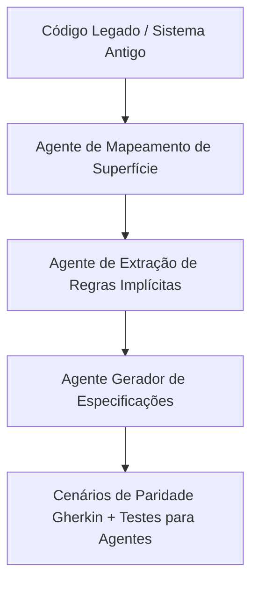
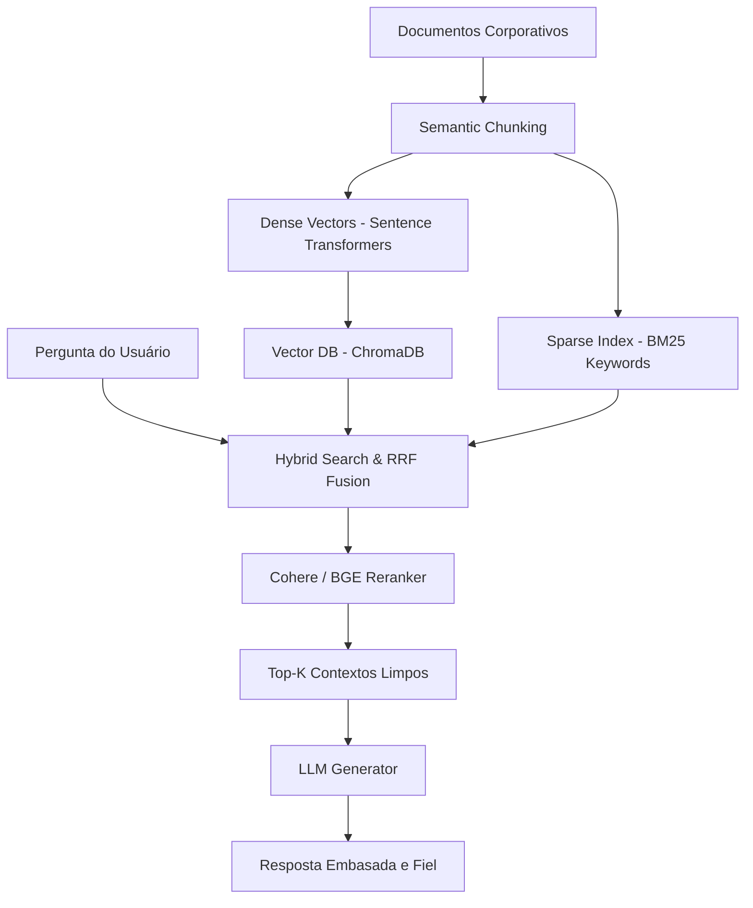

# 🚀 Apostila Oficial: Workshop de IA e Agentes Autônomos (SECOMP 2026)

Bem-vindo(a) à apostila oficial do **Workshop de IA e Agentes Autônomos** da **SECOMP 2026**! Este material foi elaborado e atualizado com base nos conceitos mais recentes de Inteligência Artificial Generativa, Agentes Autônomos, o protocolo **MCP (Model Context Protocol)** e arquiteturas de recuperação **RAG Avançado (Hybrid & GraphRAG)**.

> [!NOTE]
> **Créditos e Agradecimento Especial:**
> Este material e a metodologia adotada possuem fundamentação acadêmica e conceitual nos trabalhos, pesquisas e ferramentas desenvolvidas pelo **Prof. M.Sc. Sanderson Oliveira de Macedo (Prof. Sandeco)** — Instituto Federal de Goiás (IFG) / Universidade Federal de Goiás (UFG), criador do [Canal Sandeco](https://youtube.com/canalsandeco), do framework [Reversa](https://github.com/sandeco/reversa) e do ecossistema [Mira Animator](https://github.com/sandeco/mira-animator).

---

## 📌 Sumário
1. [Módulo 1: Introdução aos LLMs & Modelos de Raciocínio (2026)](#1-módulo-1-introdução-aos-llms--modelos-de-raciocínio-2026)
1.1 [Módulo 1.1: Guia de Prompting no Google Workspace com Gemini](#11-módulo-11-guia-de-prompting-no-google-workspace-com-gemini)
2. [Módulo 2: Engenharia de Prompts de Elite & Outputs Estruturados](#2-módulo-2-engenharia-de-prompts-de-elite--outputs-estruturados)
3. [Módulo 3: Model Context Protocol (MCP - Especificação Aberta)](#3-módulo-3-model-context-protocol-mcp---especificação-aberta)
4. [Módulo 4: Agentes Autônomos, Agent Harnesses & Framework Reversa](#4-módulo-4-agentes-autônomos-agent-harnesses--framework-reversa)
5. [Módulo 5: RAG Avançado, Busca Híbrida & GraphRAG](#5-módulo-5-rag-avançado-busca-híbrida--graphrag)
6. [Módulo 6: Segurança, Governança & OWASP Top 10 para LLMs](#6-módulo-6-segurança-governança--owasp-top-10-para-llms)
7. [Módulo 7: Projeto Prático Integrador — Career-AI (MVP 2026)](#7-módulo-7-projeto-prático-integrador---career-ai-mvp-2026)
8. [Módulo 8: Referências Acadêmicas & Trabalhos do Prof. Sanderson Macedo](#8-módulo-8-referências-acadêmicas--trabalhos-do-prof-sanderson-macedo)

---

## 1. Módulo 1: Introdução aos LLMs & Modelos de Raciocínio (2026)

Os **Grandes Modelos de Linguagem (LLMs)** evoluíram para sistemas altamente sofisticados capazes de raciocínio lógico em tempo de inferência (*Test-Time Compute*), arquiteturas de mistura de especialistas (*Mixture of Experts - MoE*) e execução nativa multimodal.

### A Evolução Arquitetural
* **Transformers Clássicos (2017-2023):** Processamento baseado unicamente em self-attention.
* **Mixture of Experts - MoE (2024-2025):** Ativação seletiva de sub-redes (especialistas) reduzindo custo computacional enquanto amplia parâmetros totais.
* **Modelos de Raciocínio (Reasoning Models / 2025-2026):** Modelos como Gemini 2.0 Flash Thinking, DeepSeek-R1 e OpenAI o1/o3 que utilizam cadeias de pensamento internas (*Chain-of-Thought*) expandidas antes de emitir a resposta final, resolvendo problemas complexos de código, matemática e lógica formal.

### Principais Capacidades Modernas
1. **Janelas de Contexto Gigantescas:** Suporte a 1M até 10M+ tokens de contexto (ex: ecossistema Gemini), permitindo carregar repositórios inteiros de código em uma única chamada.
2. **Multimodalidade Nativa:** Processamento e geração síncrona de texto, imagens, áudio e vídeo (real-time voice & vision).
3. **Structured Outputs (Saídas Garantidas):** Garantia matemática de conformidade com schemas JSON/Pydantic na camada de amostragem de tokens.

---

## 1.1. Módulo 1.1: Guia de Prompting no Google Workspace com Gemini

A integração da IA Generativa no Google Workspace une modelos de última geração aos dados institucionais em um ambiente seguro e em conformidade com a privacidade.

### Ecossistema Gemini no Workspace
1. **Aplicativos AI-First:**
   * **Gemini App (Corporate):** Chat com suporte a *Deep Research* (agente autônomo de pesquisa profunda) e *Canvas* (ambiente de edição iterativa).
   * **NotebookLM:** Assistente de pesquisa baseado nos seus documentos do Google Drive, PDFs e notas, oferecendo resumos e o *Audio Overview* (podcasts gerados via IA baseados nos seus textos).
   * **Google Vids:** Ferramenta de criação de apresentações e vídeos interativos baseados em IA.
2. **Painel Lateral Embutido:** Acesso in-line no Gmail, Docs, Slides, Sheets e Drive com grounding dinâmico via marcação `@`.

> [!IMPORTANT]
> **Governança e Privacidade:** Os dados corporativos processados pelo Gemini no Workspace **não são utilizados para treinamento de modelos públicos**, não passam por revisão humana e permanecem protegidos por criptografia de nível enterprise.

---

## 2. Módulo 2: Engenharia de Prompts de Elite & Outputs Estruturados

A **Engenharia de Prompts** é o projeto rigoroso de interfaces de entrada/saída para componentes de software de IA.

### Os 5 Pilares de um Prompt Profissional (Prompting 101)

| Pilar | Descrição | Exemplo Prático |
| :--- | :--- | :--- |
| **Persona (Papel)** | Identidade técnica ou executiva assumida pelo LLM. | *"Você é um Diretor de Tecnologia especializado em microsserviços."* |
| **Task (Tarefa)** | Ação principal detalhada iniciada por verbo no imperativo. | *"Escreva um documento de arquitetura referente à migração do sistema."* |
| **Context (Contexto)** | Informações de fundo, restrições e cenário de negócio. | *"Considerando que a equipe possui 5 desenvolvedores e utiliza AWS."* |
| **Constraints (Restrições)** | Limites que o modelo NÃO pode ultrapassar. | *"Não utilize bibliotecas obsoletas. Não invente credenciais."* |
| **Format (Formato)** | Estrutura visual exata da saída esperada. | *"Responda em formato Markdown com diagramas Mermaid e tabelas."* |

---

## 3. Módulo 3: Model Context Protocol (MCP - Especificação Aberta)

O **Model Context Protocol (MCP)** é o padrão aberto mantido sob governança da Linux Foundation (criado originalmente pela Anthropic) que revoluciona como os LLMs se conectam ao mundo externo.

### Arquitetura de Comunicação do MCP
```mermaid
graph LR
    Agent[Agente / IDE Cliente] <--> |MCP Protocol (Stdio / SSE)| MCPServer[MCP Server]
    MCPServer <--> Tools[Tools: APIs / GitHub / Terminal]
    MCPServer <--> Resources[Resources: DBs / Filesystem]
    MCPServer <--> Prompts[Prompts: Templates do Servidor]
```

### As 3 Abstrações Principais
1. **Tools (Ferramentas):** Funções executáveis com parâmetros validados por JSON Schema que o LLM pode invocar autonomamente.
2. **Resources (Recursos):** Fontes de dados expostas via URIs (`file://`, `postgres://`, `github://`) para leitura passiva pelo modelo.
3. **Prompts:** Modelos e fluxos reutilizáveis definidos pelo servidor.

---

## 4. Módulo 4: Agentes Autônomos, Agent Harnesses & Framework Reversa

Um **Agente de IA** é um sistema computacional que utiliza um LLM como motor de raciocínio central para perceber um objetivo, planejar ações, executar ferramentas em loop e ajustar sua conduta.

### O Conceito de Agent Harness (Macedo, 2026)
Conforme definido pelo Prof. Sanderson Macedo no artigo *"What makes a harness a harness"* (arXiv:2606.10106), o **Agent Harness** é a camada de software que envolve um modelo de linguagem e o capacita a atuar diretamente sobre repositórios de código com isolamento, ciclo de vida e controle de execução.

### O Framework Reversa (Macedo & Costa, 2026)
Desenvolvido pelo Prof. Sanderson Macedo, o **Reversa** ([github.com/sandeco/reversa](https://github.com/sandeco/reversa), arXiv:2605.18684) é um framework de engenharia reversa de documentação que converte sistemas legados em especificações operacionais rastreáveis e executáveis por agentes de IA através de uma pipeline multi-agente:

```mermaid
graph TD
    Legacy[Código Legado / Sistema Antigo] --> Surface[Agente de Mapeamento de Superfície]
    Surface --> Rules[Agente de Extração de Regras Implícitas]
    Rules --> Spec[Agente Gerador de Especificações]
    Spec --> Gherkin[Cenários de Paridade Gherkin + Testes para Agentes]
```

---

## 5. Módulo 5: RAG Avançado, Busca Híbrida & GraphRAG

O **RAG (Retrieval-Augmented Generation)** é a técnica essencial para fundamentar LLMs em dados corporativos atualizados, eliminando alucinações.

```mermaid
flowchart TD
    Doc[Documentos Corporativos] --> SemanticChunking[Semantic Chunking]
    SemanticChunking --> DenseEmbed[Dense Vectors - Sentence Transformers]
    SemanticChunking --> SparseIndex[Sparse Index - BM25 Keywords]
    DenseEmbed --> VectorDB[Vector DB - ChromaDB]
    
    Query[Pergunta do Usuário] --> HybridSearch[Hybrid Search & RRF Fusion]
    VectorDB --> HybridSearch
    SparseIndex --> HybridSearch
    
    HybridSearch --> Reranker[Cohere / BGE Reranker]
    Reranker --> TopKContext[Top-K Contextos Limpos]
    TopKContext --> LLM[LLM Generator]
    LLM --> FinalAnswer[Resposta Embasada e Fiel]
```

### Tecnologias do RAG Avançado
1. **Hybrid Search (Busca Híbrida):** Combinação de busca vetorial densa com busca esparsa BM25 unificadas por *Reciprocal Rank Fusion (RRF)*.
2. **Reranking:** Reordenação precisa dos fragmentos de texto via modelos *Cross-Encoder*.
3. **GraphRAG:** Integração de Grafos de Conhecimento com busca vetorial para sintetizar dados complexos interconectados.

---

## 6. Módulo 6: Segurança, Governança & OWASP Top 10 para LLMs

A segurança em sistemas com LLMs requer proteções contra ameaças atípicas ao software tradicional.

### O Top 4 de Vulnerabilidades em Sistemas com LLM (OWASP)
1. **Prompt Injection (Direta e Indireta):** Delimitação XML estrita e sanitização de inputs.
2. **Data Leakage (Vazamento de PII):** Controle de acesso RBAC no Vector DB e mascaramento prévio.
3. **Excessive Agency (Agência Excessiva):** Princípio do Menor Privilégio e aprovação humana (Human-in-the-Loop - HITL).
4. **Guardrails Ativos:** Filtros de entrada e saída operando em milissegundos (NeMo Guardrails / Llama Guard).

---

## 7. Módulo 7: Projeto Prático Integrador — Career-AI (MVP 2026)

O **Career-AI** é a aplicação prática desenvolvida no workshop que consolida todos os conceitos em uma solução end-to-end completa (FastAPI + ChromaDB + Agentes LangGraph + Frontend Web).

---

## 8. Módulo 8: Referências Acadêmicas & Trabalhos do Prof. Sanderson Macedo

Este workshop e seu material didático referenciam e incorporam as seguintes contribuições acadêmicas e bibliográficas de autoria do **Prof. M.Sc. Sanderson Oliveira de Macedo (Prof. Sandeco)**:

1. **MACEDO, Sanderson Oliveira de.** *What makes a harness a harness: necessary and sufficient conditions for an agent harness.* arXiv preprint arXiv:2606.10106, 2026. Disponível em: [https://arxiv.org/abs/2606.10106](https://arxiv.org/abs/2606.10106).
2. **MACEDO, Sanderson Oliveira de.** *From Prompt to Process: a Process Taxonomy and Comparative Assessment of Frameworks Supporting AI Software Development Agents.* arXiv preprint arXiv:2606.04967, 2026. Disponível em: [https://arxiv.org/abs/2606.04967](https://arxiv.org/abs/2606.04967).
3. **MACEDO, Sanderson Oliveira de; COSTA, Ronaldo Martins da.** *Reversa: A Reverse Documentation Engineering Framework for Converting Legacy Software into Operational Specifications for AI Agents.* arXiv preprint arXiv:2605.18684, 2026. Disponível em: [https://arxiv.org/abs/2605.18684](https://arxiv.org/abs/2605.18684).
4. **MACEDO, Sanderson Oliveira de.** Repositórios de código e projetos open-source em IA e Agentes Autônomos. GitHub: [github.com/sandeco](https://github.com/sandeco).
5. **CANAL SANDECO.** Conteúdo audiovisual, aulas e tutoriais sobre Inteligência Artificial, Aprendizado por Reforço e Agentes. YouTube: [youtube.com/canalsandeco](https://youtube.com/canalsandeco).

---
*Apostila do Workshop SECOMP 2026 — Ministrado por Emmanuel Nunes com base na metodologia e pesquisas do Prof. Sanderson Macedo.* 💙
