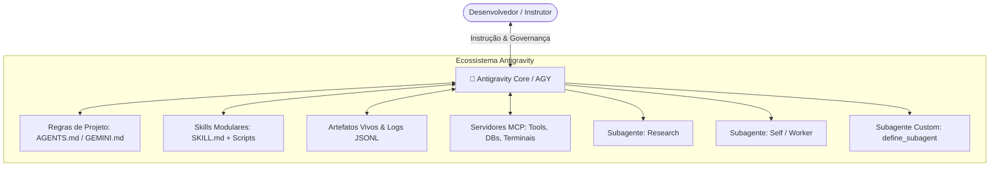

# 📑 Cheat Sheet: Google Antigravity (AGY) & Gemini 3.7 Flash

> **Referência Técnica — SECOMP 2026**: Guia de arquitetura, ferramentas e padrões para desenvolvimento agêntico de ponta com a plataforma **Google Antigravity** e o modelo vigente **Gemini 3.7 Flash**.

---

## ⚡ Parte 1: Gemini 3.7 Flash (O Modelo Vigente de Raciocínio Híbrido)

O **Gemini 3.7 Flash** é o modelo de fronteira da Google projetado especificamente para agentes autônomos, programação avançada e fluxos complexos de raciocínio lógico.

```text
┌──────────────────────────────────────────────────────────────────────────┐
│                   GEMINI 3.7 FLASH: HYBRID REASONING                     │
├────────────────────────────────────┬─────────────────────────────────────┤
│ 🚀 Modo Padrão (Standard Flash)    │ 🧠 Modo de Pensamento (Thinking)     │
│ • Latência ultrabaixa / TTFT veloz │ • Raciocínio expandido sob demanda  │
│ • Ideal para tarefas rotineiras,   │ • Ajuste dinâmico de Thinking Budget│
│   chat e chamadas diretas de tools │ • Resolução de bugs difíceis, provas │
│ • Economia máxima de tokens        │   de arquitetura e refatoração      │
└────────────────────────────────────┴─────────────────────────────────────┘
```

### 🌟 Principais Capacidades Técnicas
1. **Mecanismo de Raciocínio Híbrido (*Hybrid Reasoning*):** Unifica em um único modelo a resposta instantânea e o raciocínio profundo (*Test-Time Compute* / cadeia de pensamento ajustável).
2. **Orçamento de Pensamento (*Thinking Budget*):** Permite aos desenvolvedores calibrar o tempo de raciocínio de zero (modo instantâneo) a dezenas de milhares de tokens para problemas de alta complexidade.
3. **Janela de Contexto Massiva (1M+ Tokens):** Permite carregar livros inteiros, repositórios de software completos e históricos extensos de interação.
4. **Context Caching Nativo:** Armazena o *KV Cache* de dados estáticos com **desconto de 75% a 90%** e latência de leitura próxima de zero.
5. **Saídas Estruturadas Garantidas (*Structured Outputs*):** Conformidade estrita garantida com schemas JSON e Pydantic diretamente na camada de decodificação.
6. **Multimodalidade Nativa Total:** Raciocínio integrado sobre texto, código, diagramas de arquitetura, imagens, áudio e vídeo.

---

## 🚀 Parte 2: Google Antigravity (AGY — Plataforma de Desenvolvimento Agêntico)

O **Google Antigravity (AGY)** é a plataforma avançada criada pela equipe do Google DeepMind para transformar LLMs em parceiros de programação autônomos (*Agentic Pair Programming*).



### 🏛️ Os 5 Pilares do Antigravity

#### 1. 👥 Subagentes Concorrentes & Especializados
* **Delegação Assíncrona:** O agente principal pode instanciar subagentes especializados (`research`, `self` ou agentes sob demanda criados via `define_subagent`).
* **Isolamento de Espaço de Trabalho (*Workspaces*):** Modos `inherit` (compartilha pasta), `branch` (workspace isolado com branch Git própria) e `share` (worktree compartilhada).
* **Comunicação Inter-Agentes:** Troca de mensagens estruturadas via `send_message` e supervisão reativa sem necessidade de loops de polling ativos.

#### 2. 🧩 Sistema de Skills Padronizado
* Toda capacidade especializada é encapsulada em uma pasta modular contendo um arquivo central **`SKILL.md`** com cabeçalho YAML frontmatter:
```markdown
---
name: minha-skill-especializada
description: Descrição precisa de quando e como o agente deve ativar esta habilidade.
---
# Instruções detalhadas da Skill...
```
* Pode conter pastas auxiliares como `scripts/`, `examples/`, `resources/` e `references/`.

#### 3. 📜 Governança Estrita & Regras Vivas (`AGENTS.md` / `GEMINI.md`)
* Arquivos markdown raiz que definem as restrições arquiteturais, padrões de código, estilo de comunicação e regras invioláveis do projeto.

#### 4. 📄 Artefatos Vivos e Transcrições Auditáveis
* **Artefatos:** Documentos estruturados e iterativos gerados para o usuário (planos, relatórios, especificações).
* **Transcrições JSONL:** Registro integral passo a passo de todas as ações, chamadas de ferramentas e decisões no arquivo `transcript.jsonl`.

#### 5. 🔌 Integração Nativa com MCP (Model Context Protocol)
* Comunicação padronizada com ferramentas de terminal, sistemas de arquivos, bancos de dados e APIs externas via especificação aberta MCP.

---

## 📊 Matriz Comparativa: Modelos e Ferramentas no Workshop

| Dimensão | Gemini 3.7 Flash | Modelos Clássicos (2023-2024) |
| :--- | :--- | :--- |
| **Raciocínio** | Híbrido (Instantâneo + Thinking Mode) | Fixo / Apenas uma velocidade |
| **Janela de Contexto** | 1.000.000+ tokens | 8.000 a 128.000 tokens |
| **Context Caching** | Nativo (redução de até 90% no custo) | Inexistente / Reenvio de prompt |
| **Tool Calling / MCP** | De primeira classe com saídas tipadas | Suporte básico / propenso a falhas |
| **Plataforma Recomendada** | **Google Antigravity (AGY)** | Interfaces de chat simples |

---

## 🛠️ Comandos e Fluxo de Trabalho no Antigravity

```bash
# Iniciar sessão do Antigravity CLI no projeto
agy

# Executar com modelo vigente de alta capacidade
agy --model gemini-3.7-flash

# Gerenciamento de habilidades (Skills)
agy skills list
```
