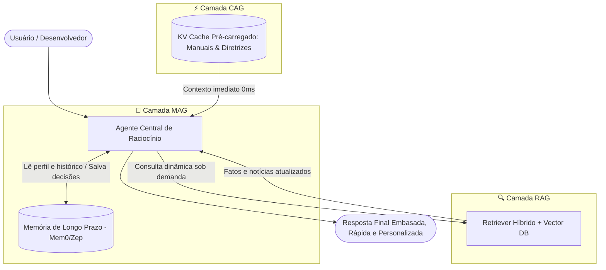

# 📑 Cheat Sheet: RAG vs. CAG vs. MAG (Paradigmas de Contexto e Memória em IA)

> **Regra de Ouro:** Não existe uma arquitetura "perfeita" única. A melhor escolha depende diretamente da frequência de atualização dos dados, requisitos de latência e necessidade de persistência de estado do agente.

---

## ⚡ Resumo Executivo & Matriz Rápida de Decisão

```text
┌──────────────────────────────────────────┬──────────────┬───────────────────────────────────────────┐
│ Cenário / Requisito Principal            │ Paradigma    │ Solução Arquitetural                      │
├──────────────────────────────────────────┼──────────────┼───────────────────────────────────────────┤
│ Os dados mudam com alta frequência?     │ 🔍 RAG       │ Retrieval-Augmented Generation            │
│ Dados estáveis + velocidade crítica?     │ ⚡ CAG       │ Cache-Augmented Generation                │
│ Agentes precisam de estado persistente?  │ 🧠 MAG       │ Memory-Augmented Generation               │
└──────────────────────────────────────────┴──────────────┴───────────────────────────────────────────┘
```

---

## 🔍 1. RAG (Retrieval-Augmented Generation)

O **RAG** busca dinamicamente fragmentos de informação em uma base de conhecimento externa (banco vetorial / índice de busca) em tempo de execução e os injeta no prompt do modelo.

### ⚙️ Arquitetura e Fluxo
```text
Documentos ──> Chunking ──> Embeddings ──> Vector DB (ChromaDB / Pinecone)
                                                ▲
                                                │ (Busca Semântica / Top-K)
Pergunta do Usuário ────────────────────────────┴──> Contexto Injetado ──> LLM ──> Resposta
```

* **Fonte de Dados:** Bases de documentos externos (PDFs, planilhas, bancos de dados, APIs, repositórios).
* **Mecanismo:** Recuperação dinâmica via similaridade de cosseno, busca híbrida (BM25 + Vetorial) e Reranking.
* **Latência (TTFT):** **Média a Alta** (Overhead de gerar embeddings da query + busca no banco + reranking + inferência).
* **Escalabilidade:** **Massiva** (Lida facilmente com terabytes de dados e milhões de documentos).
* **Custo:** Proporcional ao número de tokens dos chunks recuperados + custo da infraestrutura vetorial.
* **Pontos Fortes:** Dados sempre atualizados em tempo real sem necessidade de reprocessar o modelo; isolamento de permissões (RBAC).
* **Desafios / Limitações:** Fragmentação de contexto (*chunking loss*), falhas no recuperador (*retrieval failure*), latência adicional.
* **Casos de Uso Ideais:** Manuais corporativos dinâmicos, bases de suporte com tickets diários, notícias em tempo real, bases jurídicas e regulatórias com alterações constantes.

---

## ⚡ 2. CAG (Cache-Augmented Generation)

O **CAG** aproveita as janelas de contexto gigantescas dos modelos modernos (1M a 10M+ tokens) e tecnologias de **Context Caching / KV Caching** (Prompt Caching / Prefix Caching) para pré-carregar toda a base de conhecimento diretamente na memória do LLM.

### ⚙️ Arquitetura e Fluxo
```text
Base Estática Completa ──> Pré-carga no Context Window / KV Cache (vLLM / Gemini / Claude)
                                      │
                                      ▼ [Cache Persistente em GPU/Memória]
Pergunta do Usuário ──────────> Inferência Direta com Contexto Total ──> Resposta Instantânea
```

* **Fonte de Dados:** Documentos estáticos ou de baixa volatilidade carregados integralmente no contexto.
* **Mecanismo:** Reutilização dos estados intermediários dos *Key-Value pairs* da atenção (KV Cache) calculados previamente.
* **Latência (TTFT):** **Ultra Baixa** (Ignora toda a etapa de embedding, busca vetorial e reranking; resposta quase instantânea).
* **Escalabilidade:** Limitada pela janela máxima de contexto do modelo e custo de retenção do cache na memória/GPU.
* **Custo:** Redução dramática (75% a 90% de desconto no custo por milhão de tokens cacheados).
* **Pontos Fortes:** **100% de recall do contexto** (sem perda de trechos por fragmentação), compreensão global e relacional do documento inteiro, latência mínima.
* **Desafios / Limitações:** Inviável para bases que sofrem alterações minuto a minuto (qualquer alteração invalida e exige reconstruir o cache).
* **Casos de Uso Ideais:** Manuais de equipamentos congelados, documentação estável de APIs, livros didáticos, código-fonte de projetos em revisão, regulamentos e normas anuais.

---

## 🧠 3. MAG (Memory-Augmented Generation)

O **MAG** é focado na retenção e evolução contínua do estado, preferências, aprendizados e memórias de agentes ao longo de múltiplas sessões e interações com o usuário.

### ⚙️ Arquitetura e Fluxo
```text
Interação do Usuário ──> Agente de IA ──> Extração de Memória (Fatos, Preferências, Decisões)
                             │                  │
                             ▼                  ▼
                    Memória de Trabalho    Memória de Longo Prazo (Mem0 / Letta / Zep)
                             ▲                  │
                             └──────────────────┘ (Recuperação e Consolidação)
```

* **Tipos de Memória no MAG:**
  * **Memória Episódica:** Registro de eventos passados e diálogos específicos (*"Na semana passada o usuário preferiu a linguagem Go"*).
  * **Memória Semântica:** Fatos consolidados sobre o usuário ou domínio (*"O usuário é desenvolvedor sênior backend e trabalha na UNEMAT"*).
  * **Memória Procedural:** Regras de comportamento e estratégias que o agente aprendeu a aplicar (*"Sempre formatar respostas com testes unitários"*).
* **Mecanismo:** Extração assíncrona de fatos, consolidação, esquecimento controlado (*memory decay*) e injeção contextual de memórias relevantes.
* **Latência (TTFT):** **Otimizada e Adaptativa** (Leitura rápida de perfis e memórias-chave).
* **Escalabilidade:** Escala por usuário/agente ao longo de meses ou anos de interação contínua.
* **Pontos Fortes:** Personalização profunda, experiência humana contínua, capacidade do agente de evoluir e não repetir erros passados.
* **Desafios / Limitações:** Gerenciamento de memórias conflitantes ou obsoletas; custo computacional de consolidação e reflexão contínua.
* **Casos de Uso Ideais:** Assistentes pessoais, copilotos de programação, mentores de carreira (como o Career-AI), companheiros de saúde e agentes autônomos de longa duração.

---

## 📊 Tabela Comparativa Multidimensional

| Dimensão | 🔍 RAG (Retrieval) | ⚡ CAG (Cache) | 🧠 MAG (Memory) |
| :--- | :--- | :--- | :--- |
| **Objetivo Central** | Fundamentação em dados externos | Baixa latência em dados estáticos | Continuidade e personalização |
| **Origem do Contexto** | Banco vetorial / Índices externos | Context Window pré-carregada / KV Cache | Armazenamento de memórias persistentes |
| **Dinamismo dos Dados** | Alto (mudanças frequentes) | Baixo / Estático | Evolutivo (cresce com o uso) |
| **Latência (TTFT)** | Média / Alta (overhead de busca) | Ultra Baixa (cache quente) | Baixa a Média (leitura de perfil) |
| **Integridade de Contexto** | Fragmentado (chunks individuais) | Completo (documento na íntegra) | Sintetizado (fatos consolidados) |
| **Tecnologias Típicas** | ChromaDB, Pinecone, BM25, Cohere | Gemini Context Caching, Claude Caching, vLLM | Mem0, Letta (MemGPT), Zep, LangGraph Store |
| **Custo de Token** | Padrão por chamada | 75% a 90% mais barato em cache | Baixo (apenas memórias relevantes) |
| **Principal Ponto Fraco** | Alucinação por chunks cortados | Custo de invalidação se dados mudarem | Conflito entre memórias antigas e novas |

---

## 🏗️ A Arquitetura Tri-Híbrida de 2026 (RAG + CAG + MAG)

Em sistemas de produção de nível corporativo e agentes avançados, as três técnicas operam de forma sinérgica e complementar:



* **CAG** fornece o núcleo estável de conhecimento (ex: regras de negócio, manuais técnicos e código-base congelado) com latência quase nula.
* **RAG** fornece a capacidade de consultar dados vivos e externos (ex: vagas abertas, notícias do dia, logs em tempo real).
* **MAG** mantém a identidade do usuário, suas metas de carreira e o histórico de evolução ao longo de todas as sessões.
