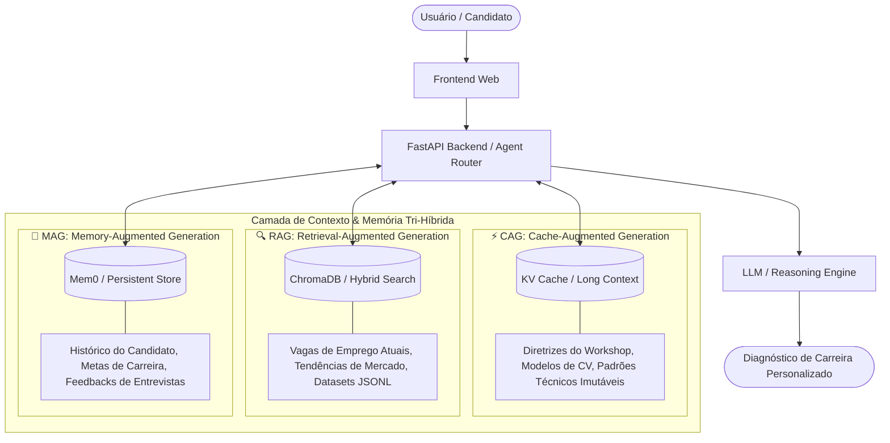

# Arquitetura do Sistema (Career-AI)

Este documento descreve a arquitetura técnica e os padrões de contexto do nosso **Assistente de Carreira Inteligente (Career-AI)**, desenvolvido para a SECOMP 2026.

---

## 🏛️ Componentes Principais

* **Frontend**: Interface web moderna e responsiva para interação do usuário final, visualização de feedbacks e submissão de currículos.
* **Backend**: API Python construída em FastAPI, responsável por gerenciar rotas assíncronas, orquestração de chamadas de modelos e integração de dados.
* **Motor de Agentes & MCP**: Lógica autônoma (LangGraph / Agent Harness) capaz de planejar etapas, invocar ferramentas locais e remotas via protocolo **MCP (Model Context Protocol)** e iterar até a conclusão da tarefa.

---

## 🧩 Camada de Contexto & Memória: A Tríade RAG + CAG + MAG

Para garantir respostas embasadas, latência mínima e personalização contínua ao longo de múltiplas interações, o Career-AI adota a **Arquitetura Tri-Híbrida de 2026**:

### 1. 🔍 Camada RAG (Retrieval-Augmented Generation) — Dados Vivos de Mercado
* **Função:** Consulta a base dinâmica de vagas de tecnologia, descrições de cargos e relatórios de mercado em tempo real.
* **Mecanismo:** Indexação vetorial no ChromaDB + busca semântica por similaridade de cosseno.
* **Por que RAG?** As vagas de tecnologia mudam diariamente; o RAG garante dados frescos sem custo de fine-tuning.

### 2. ⚡ Camada CAG (Cache-Augmented Generation) — Diretrizes Estáticas com Latência Zero
* **Função:** Mantém as regras oficiais de formatação curricular, frameworks de competências e rubricas de avaliação pré-carregadas no *KV Cache* do LLM.
* **Mecanismo:** Prompt / Context Caching que elimina overhead de busca e reduz os custos de inferência em até 90%.
* **Por que CAG?** Padrões curriculares e manuais de engenharia são estáveis; o pré-carregamento garante 100% de precisão contextual e resposta instantânea (baixo TTFT).

### 3. 🧠 Camada MAG (Memory-Augmented Generation) — Evolução Contínua do Usuário
* **Função:** Armazena o perfil contínuo do usuário, metas profissionais, pontos fracos identificados em simulações anteriores e histórico de evolução.
* **Mecanismo:** Memórias episódicas e semânticas consolidadas de forma persistente entre sessões.
* **Por que MAG?** Uma mentoria de carreira eficaz requer continuidade; o agente lembra de conselhos anteriores e acompanha o progresso do aluno da SECOMP ao longo dos laboratórios.
